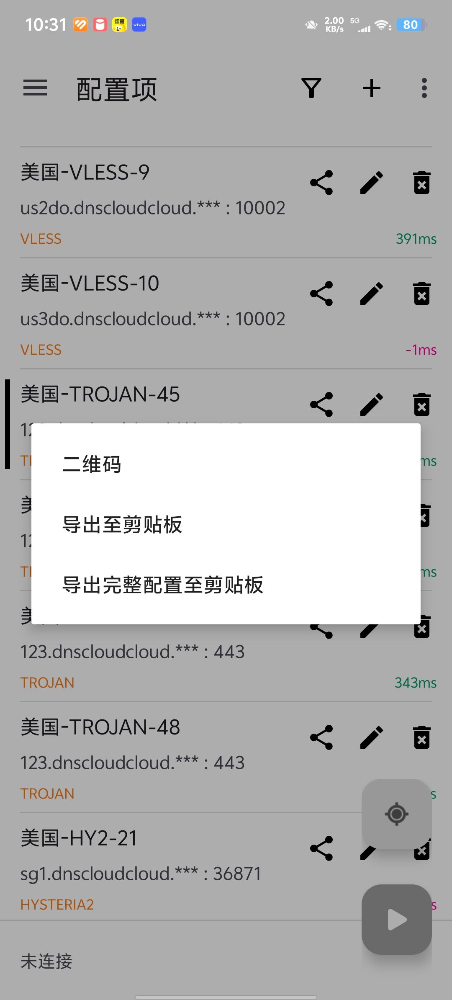

## 介绍

这是一个小脚本，用于在windows上使用v2ray核心翻墙。

写这个脚本的起因是nixos上的clash verge rev貌似不支持我正在使用的机场，且v2rayN在linux上并不好用。

## 用法

1. 首先打开手机版v2rayNG(电脑版v2rayN也行，但用了这个也没必要用这个脚本了)。选中一个可用节点的**分享**按钮，点击**导出完整配置至剪贴板**。



2. 复制到当前文件夹下，命名为v2ray-config.json。

3. 在字段"inbounds"下添加:

```json
 "inbounds": [
    //原本就有的（如果已经有http策略就不需要了）
    {
      "listen": "127.0.0.1",
      "port": 10809,
      "protocol": "http",
      "tag": "http"
    }
  ],
```

4. 最后在终端运行node .\v2ray-run.js start

> 注意，如果直接ctrl+c或者关闭终端会导致系统无法联网，请在终端执行node .\v2ray-run.js stop后即可关闭系统代理，正常访问国内网络。
